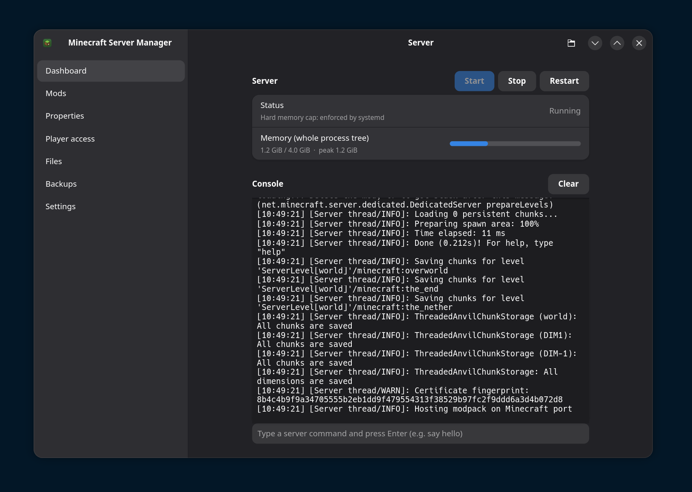
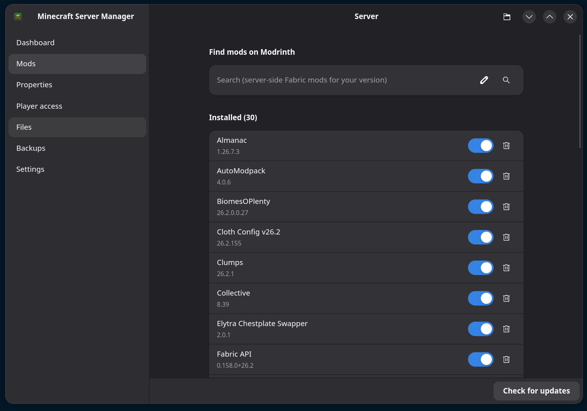
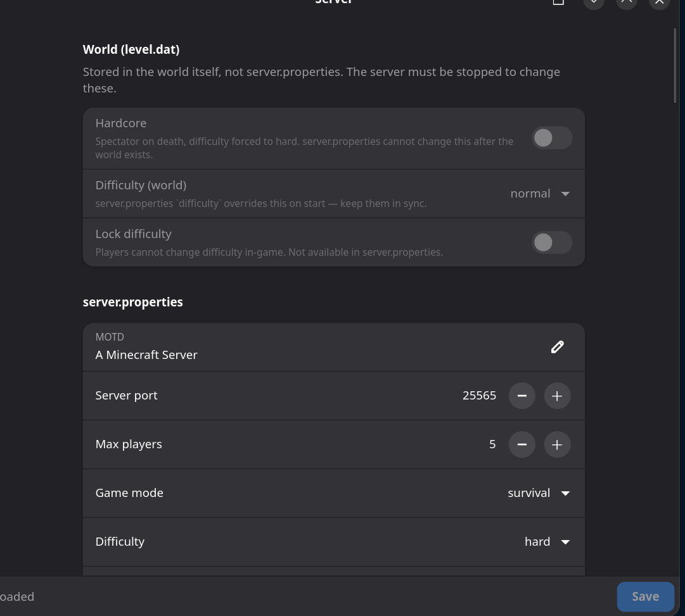
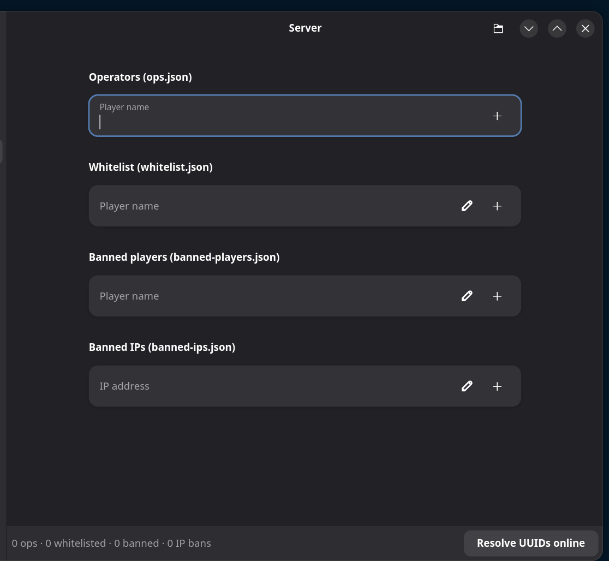
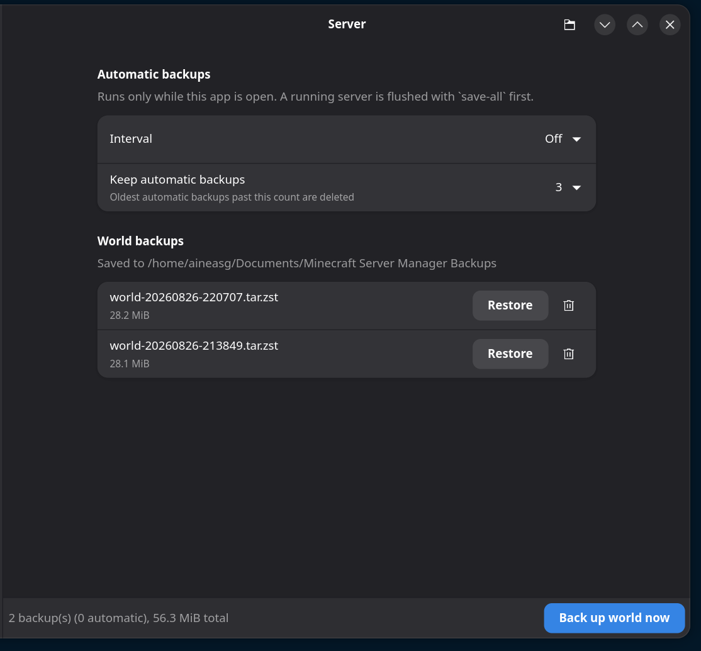
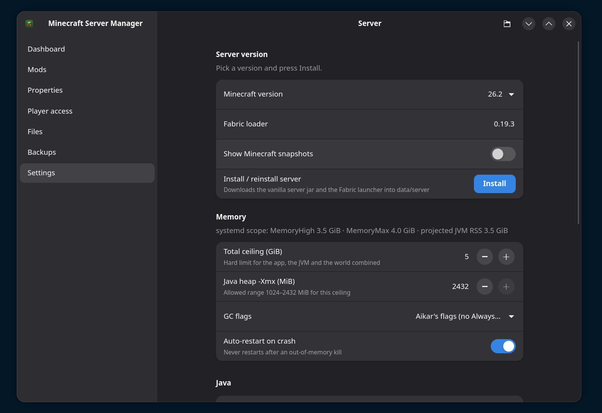
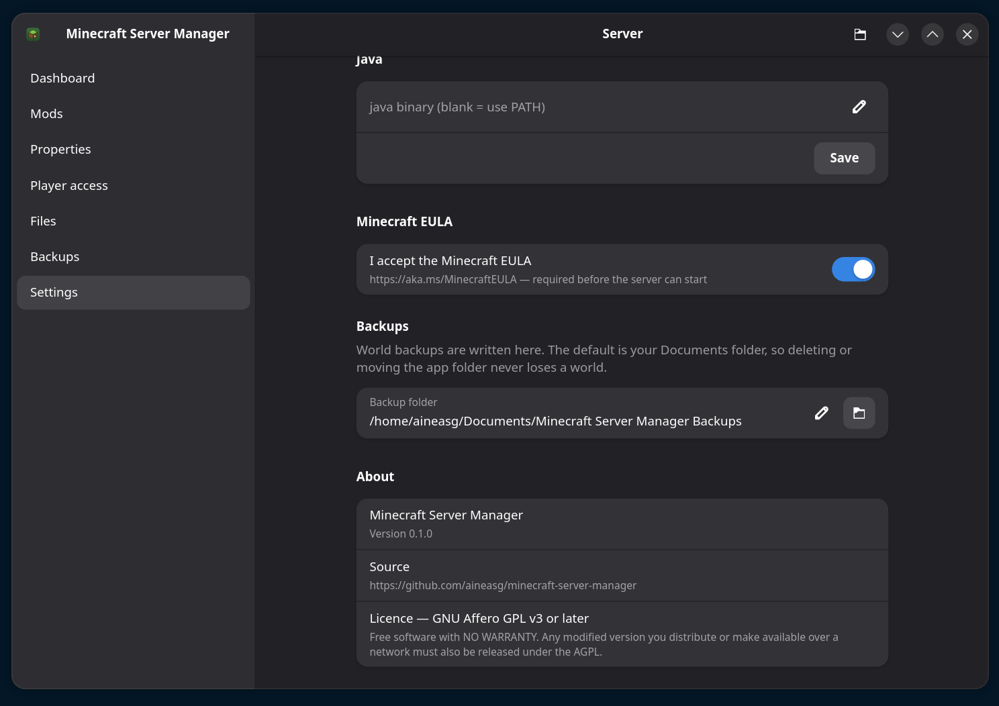

<div align="center">


# 🐧 Linux Minecraft Server Manager

[](https://github.com/aineasg/minecraft-server-manager/actions/workflows/ci.yml)
[](LICENSE)

</div>

Are you sick of searching for hours for a Linux Minecraft server manager, only to
find complex Docker setups or fragile Python scripts? **Me too.**

I wanted something simple: an intuitive GUI to manage my world, auto-install
mods, handle updates, and keep backups so I never lose progress. No more
difficult configs. No more waiting 30 seconds for a modded world to load.

**You've found it.**

<div align="center">
  
</div>

## ⚡ Why Rust?

This tool is built in **Rust** for maximum performance and memory safety.

- **Speed:** Load worlds with 300+ mods in **5 seconds**, not 30.
- **Simplicity:** No bloated dependencies. One command and the window opens.
- **Reliability:** You set one memory number; the kernel enforces it. No more
  random out-of-memory crashes taking the world down with them.

## 🚀 How to Run

It's as simple as it gets. Clone the repo and run:

```bash
git clone https://github.com/aineasg/minecraft-server-manager
cd minecraft-server-manager
./install.sh
```

That's it. It grabs the build and runtime dependencies with your package manager
(asks for `sudo` once, just for that), compiles a release binary, and drops it
plus a menu entry into `~/.local`. Then launch **Minecraft Server Manager** from
your app menu.

No hidden config files, no daemon to set up. `./install.sh --uninstall` removes
everything — your worlds and settings are never touched.

**What you'll need:** the script pulls in GTK 4 + libadwaita for you. You also
want a JRE (**Java 21+** for modern Minecraft), `tar` with `--zstd` plus the
`zstd` binary, and `systemd --user` for the hard memory cap (without it the
server still runs, the ceiling just becomes a suggestion).

On Arch you can also build a proper package: `cd packaging && makepkg -si`.
Just want to try it without installing anything? `cargo run --release -p mcsm-gui`.

## 🎮 What it does

- **Dashboard** — start/stop/restart, a live console you can type commands into,
  a real-time memory meter for the whole process tree, and auto-restart (which
  stays out of the way after an out-of-memory kill).
- **Mods** — search Modrinth for server-side Fabric mods that match your version,
  install them with their dependencies pulled in automatically, enable/disable
  without deleting, and check the whole folder for updates at once. Jars you
  dropped in by hand are recognised too.
- **Properties** — a proper form for `server.properties` that keeps your comments
  and ordering, a raw section for anything exotic, and a **World (level.dat)**
  group that flips **hardcore**, difficulty, and difficulty-lock on a world
  that's *already* generated.
- **Player access** — ops, whitelist, and bans. Applied live as console commands
  while the server runs, written to JSON when it's stopped.
- **Backups** — `tar --zstd` snapshots of the world, on a schedule with a
  retention count, plus one-click restore and delete. A running server gets a
  `save-all` flush first. They land in your **Documents** folder by default, so
  deleting the app never costs you a world.
- **Files** — a plain-text editor for anything under the data folder.
- **Settings** — install a Minecraft + Fabric version (no separate
  Fabric-installer step), set the memory budget and GC flags, point at your Java,
  accept the EULA, choose the backup folder.

## 📸 A look around

<table>
<tr>
<td width="50%"><br><sub><b>Mods</b> — search Modrinth, toggle without deleting, bulk update check</sub></td>
<td width="50%"><br><sub><b>Properties</b> — a typed <code>server.properties</code> form plus level.dat toggles</sub></td>
</tr>
<tr>
<td><br><sub><b>Player access</b> — ops, whitelist and bans, applied live</sub></td>
<td><br><sub><b>Backups</b> — scheduled snapshots with retention, one-click restore</sub></td>
</tr>
<tr>
<td><br><sub><b>Settings</b> — version install, the memory ceiling, GC flags</sub></td>
<td><br><sub><b>Settings</b> — Java path, EULA, backup folder, licence</sub></td>
</tr>
</table>

## 📁 Where your stuff lives

Everything sits in **one folder**:

- run from a cloned repo → it's `./data/` inside the checkout
- installed → it's `~/.local/share/MinecraftServerManager/`
- or set `MCSM_ROOT=/some/path` to put it wherever you like

```
<root>/
├── state.toml            your settings (plain text, editable by hand)
├── server/               jars, world, mods/, config/, ops.json, whitelist.json, …
│   └── logs/             the server's own logs, written by Java
├── cache/                downloaded jars, reused across reinstalls
└── logs/                 reserved for an app log; nothing writes here yet
```

Backups are the exception — they go to
`~/Documents/Minecraft Server Manager Backups/` so a deleted app folder never
takes a world with it. Change that in **Settings → Backups**.

### First run

1. **Settings** → pick a Minecraft version and Fabric loader → **Install**.
2. **Settings** → accept the Minecraft EULA.
3. Set the memory ceiling if 9 GiB isn't right for your machine.
4. **Dashboard** → **Start**.

Run `MCSM_LOG=debug mcsm` if you want verbose logs.

## 🧵 Current support & roadmap

- ✅ **Fabric** (fully supported)

**Want Purpur, Spigot, or Paper?** I play daily, so this gets regular updates
based on real use. If you need another loader,
[open an issue](https://github.com/aineasg/minecraft-server-manager/issues) and
ask — I'll add it.

## 🛠️ Hacking on it

```bash
cargo fmt --all
cargo clippy --workspace --all-targets -- -D warnings
cargo test --workspace          # unit tests, no network
```

`crates/mcsm-core` is all the logic with no GTK anywhere in it; `crates/mcsm-gui`
is a thin Relm4 layer, one module per page. [`DESIGN.md`](DESIGN.md) explains why
things are the way they are; [`CONTRIBUTING.md`](CONTRIBUTING.md) has the rest.

## 📜 Licence

[GNU Affero General Public License v3.0 or later](LICENSE). Free software, **no
warranty**. If you hand out a modified version — or run one as a network service
for other people — your changes have to be AGPL too.

---

*Built by Aineasg for Linux users who value their time.*
